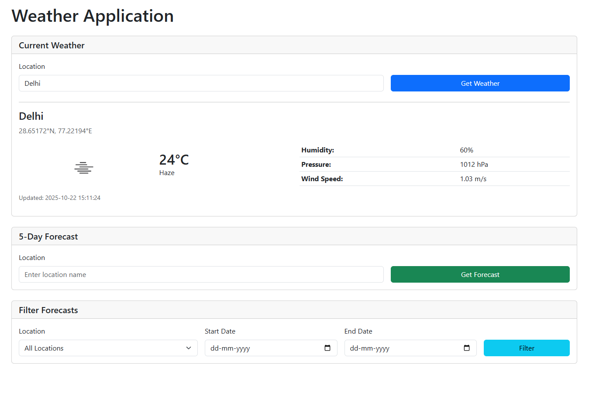

### Prerequisites

- PHP 8.2 or higher
- Composer
- MySQL
- OpenWeather API Key
- Database `weatherapp`

### Installation

1. **Clone the repository**
   ```bash
   git clone git@github.com:nkshinkx/weatherApp.git
   cd weatherApp
   ```

2. **Install PHP dependencies**
   ```bash
   composer install
   ```

3. **Set up environment file**
   ```bash
   cp .env.example .env
   ```

4. **Generate application key**
   ```bash
   php artisan key:generate
   ```

5. **Get OpenWeather API Key**
   - Visit [OpenWeather API](https://openweathermap.org/api)

6. **Configure environment variables**
   
   Open `.env` file and add your OpenWeather API key:
   ```env
   WEATHER_API_KEY="your_api_key_here"
   ```

7. **Set up database**
   
   Configure MySQL credentials in `.env`:
   ```env
   DB_CONNECTION=mysql
   DB_HOST=127.0.0.1
   DB_PORT=3306
   DB_DATABASE=weatherapp
   DB_USERNAME=root
   DB_PASSWORD=
   ```

8. **Run migrations**
   ```bash
   php artisan migrate
   ```

9. **Start the development server**
   ```bash
   php artisan serve
   ```

10. **Visit the application**
    
    Open your browser and navigate to: `http://127.0.0.1:8000`

## Usage

### Current Weather
1. Enter a city name in the "Current Weather" section
2. Click "Get Weather"
3. View current temperature, humidity, pressure, wind speed, and condition

### 5-Day Forecast
1. Enter a city name in the "5-Day Forecast" section
2. Click "Get Forecast"
3. View detailed forecast table with 3-hour intervals for next 5 days

### Filter Forecasts
1. Select a location from the dropdown 
2. Set start and end dates 
3. Click "Filter"
4. View filtered forecast results in table

## Technical Stack

- **Backend**: Laravel 12
- **Database**: MySQL 
- **API**: OpenWeather API (Geocoding & Current Weather)
- **Frontend**: Vanilla JavaScript, HTML5, CSS3
- **HTTP Client**: Guzzle (via Laravel HTTP)

## Project Structure

```
app/
├── Http/
│   └── Controllers/
│       └── WeatherController.php    # Handles weather & forecast requests
├── Models/
│   ├── Location.php                 # Location model
│   ├── WeatherRecord.php            # Current weather data model
│   ├── Forecast.php                 # Forecast data model
│   └── ApiRequest.php               # API logging model
└── Services/
    └── WeatherService.php           # OpenWeather API integration

database/
└── migrations/
    ├── 2025_10_18_092428_create_locations.php
    ├── 2025_10_18_092532_create_weather_records.php
    ├── 2025_10_18_092592_create_api_requests.php
    └── 2025_10_18_120103_create_forecasts.php

resources/
└── views/
    └── weather/
        └── index.blade.php          # Bootstrap-based UI

routes/
└── web.php                          # Application routes
```


## API Endpoints

- `GET /` - Display weather application page
- `POST /weather` - Fetch current weather data for a location
  - Request: `{ "location": "city name" }`
  - Response: Current weather data with location coordinates
- `POST /forecast` - Fetch 5-day forecast for a location
  - Request: `{ "location": "city name" }`
  - Response: Forecast data array with 3-hour intervals
- `GET /filter-forecasts` - Filter stored forecasts
  - Query: `?location_id=1&start_date=2025-10-18&end_date=2025-10-20`
  - Response: Filtered forecast data

